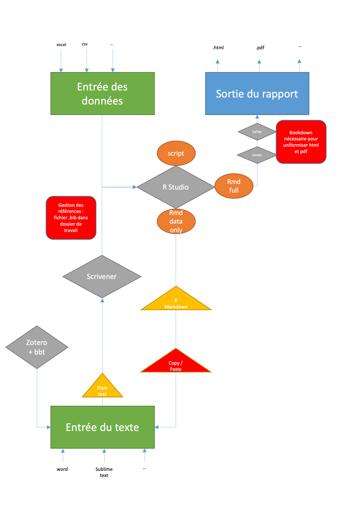

# Environnement de travail

Notre configuration de travail implique:

+ *GitHub* qui agit comme lieu principal de **stockage**, de **communication** de codes ou/et résultats, de **versioning**. 
+ *RStudio* dont le fonctionnement avec `bookdown` est particulièrement appréciable
+ *Sublime Text* qui doit être mieux connue mais permet de travailler sur des bouts de code avec une syntaxe couleurs et facilite ainsi le *copier/coller* d'anciens projets vers de nouveaux.

## GitHub et structure des dossiers

<!-- explication, avantages, inconvénients 

reprendre le démarrage de projets depuis le site de Silvia -->

On dispose d'un compte chez *GitHub*. Le compte est lié à 3 machines (2 macs et un pc). Le *commit* et le *push* se réalisent depuis RStudio directement. Sur chaque machine, on s'offre tout de même une solution *user friendly* avec *GitHub Desktop*.

Sur chaque machine, on dispose d'une structure des dossiers de type *Documents > GitHub > r-projects* (attention à la casse).

Le dossier *r-projects* contient autant de sous-dossiers que de projets à analyser. 

Chaque sous-dossier a un nom structuré ainsi (attention à la casse) : *contexteannée_initialesauteurprincipal* (par exemple : *dupp2019_cr* ou *crips2019_lv*).

Dans chaque sous-dossier:

+ un fichier *Rproj* est disponible et il porte le nom du sous-dossier
+ un fichier présentant les données brutes (raw) est disponible (en lecture seule de préférence) et il porte un titre de la forme *nomsousdossier_raw*. Il peut être en format *.csv* ou *.xlsx*. Si les données brutes sont sur plusieurs fichiers (dans le cas de plusieurs temps de mesure, par exemple, on les distingue avec l'ajout *_t1*, ...)
+ un fichier de script *.R* intitulé *nomsousdossier_script*
+ un fichier Rmarkdown *.Rmd* intitulé *nomsousdossier_rapport* et rédigé en parallèle du script. Ce rapport général appelle le script pour réaliser les sorties.

> On ne s'est pas encore déterminé sur les bonnes pratiques pour la constitution du rapport en RMarkdown : Est-ce OK et satisfaisant de "simplement" rappeler le script et uniquement "afficher" les objets ?

+ les sorties de type *HTML*, *PDF*, ou image (*png*, *svg*, ...) n'obéissent pas à des règles précises.
+ plusieurs rapports peuvent coexister en fonction des destinataires ; ils sont tous une adaptation du rapport "master" décrit plus haut.

L'intérêt est d'avoir à tout moment sur GitHub une vision claire des modifications réalisées à travers les différentes étapes de mise à jour des fichier (traçabilité de la démarche). De plus, une attention particulière est accordée à l'écriture d'un code avec une grammaire (le plus possible) conventionnelle qui est lisible et commenté, que ce soit dans le script ou dans le rapport en RMarkdown.

Le script et le rapport se rédigent en parallèle.

## Rédaction du code et grammaire

Le code suivant est, à notre sens, un exemple de bonne pratique car :

+ des titres mis en évidence structurent le code
+ les commentaires sont présents; ils se veulent précis et concis
+ des espaces facilitent la lecture
+ le code n'est pas *- à notre connaissance -* inutilement répétitif

```{r exemple1, echo=TRUE, eval=FALSE}
###############
#visualisation#
###############

#score échelle HBSC

vis_hbs <- d_long_paired %>% 
  ggplot() +
  aes(x = temps, color = group, y = hbs_sco) +
  geom_boxplot(alpha = .5) +
  geom_jitter(size = 5, alpha = .5, position = position_jitterdodge(dodge.width=.7, jitter.width = .2)) +
  stat_summary(fun = mean, geom = "point", size = 3, shape = 4) +
  stat_summary(fun = mean, aes(group = group), geom = "line") +
  labs(title = "Mesure des CPS", y = "Score au HBSC") +
  theme(plot.title = element_text(hjust = 0.5)) +
  scale_color_brewer("Groupe", palette = "Set1")
```

Un autre exemple illustre cette grammaire. On rajoute quelques espaces pour faciliter la lecture et repérer les structures *- parfois nécessairement -* répétitives :

> On aimerait toutefois savoir comment éviter ces répétitions. Notamment quand on génère 10 graphiques qui ne varient, dans le code, qu'au niveau de l'axe Y et le titre, par exemple.

```{r exemple2, echo=TRUE, eval=FALSE}
#Création des moyennes de chaque questionnaire pour chaque observation

d_long <- d_long %>% 
  mutate(hbs_sco = rowMeans(select(.,starts_with("hbs")),na.rm =T),
         pec_sco = rowMeans(select(.,starts_with("pec")),na.rm =T),
         be_sco  = rowMeans(select(.,starts_with("be")) ,na.rm =T),
         est_sco = rowMeans(select(.,starts_with("est")),na.rm =T),
         cli_sco = rowMeans(select(.,starts_with("cli")),na.rm =T),
         sou_sco = rowMeans(select(.,starts_with("sou")),na.rm =T),
         mot_sco = rowMeans(select(.,starts_with("hbs")),na.rm =T))
```

**Une source pour la grammaire du codage peut être consultée à l'adresse :** https://www.inwt-statistics.com/read-blog/inwts-guidelines-for-r-code.html 

## RStudio et packages

On dispose en l'état de la version 4.0.2 de R ainsi que de la version 1.3.959 de RStudio.

Sur les macs, différents ajouts comme Xquartz ou des modules liés à LaTeX sont également installés.

> Mais honnêtement, on a perdu de vue leur rôle plus ou moins nécessaire sachant que LaTeX est certes nécessaire pour les sorties PDF sans que toutes les extensions liées à LaTex le soient... Ce sera à clarifier au prochain clean install.

Pour la version PC, on a installé tinyTEX 'tinytex::install_tinytex()' directement 'TinyTeX to C:\Users\nbr\AppData\Roaming/TinyTeX' depuis la console. On rappelle que `LaTeX` est nécessaire à la génération de *PDF*.

Dans R, les packages suivants sont installés:

+ `tidyverse`, suite de packages pour travailler de manière *tidy* (bien rangé) : `ggplot2`, `dplyr`, `tidyr`, `readr`, `purrr`, `tibble`, `stringr`, `forcats`.
+ `readxl`, permet de lire et importer les fichiers .xlsx.
+ `bookdown`, permet de réaliser à peu de frais le présent livre

En principe, pour des raisons d'élégance du code, on cherche à limiter la sur-installation de nouveaux packages. Il s'agit d'explorer ce que les packages installés ont à offrir avant de courir sur d'autres fonctions vues sur le web.

## Sublime Text et Packages

L'utilisation de Sublime Tex est ergonomique. Les packages du logiciel permettent de travailler comme R Studio, avec toutefois un environnement plus aéré et propice à la rédaction avec des codes couleurs agréables. Il est complémentaire à RStudio mais peut carrément le remplacer pour certaines courtes étapes de rédaction.

Les packages installés sont:

+ sur PC : R-Box, R-IDE, LSP
+ sur MAC : R-Box, SendCode

> On doit encore clarifier comment lier sur PC et MAC GitHub. Mais ce n'est pas prioritaire. GitHub sur Sublime Text ? Emmet, git, sublime github. https://gist.github.com/KedrikG/f7b955dc371b1204ec76ce862e2dcd2e

## Scrivener 3 + Zotero + BetterBibText - Rédaction d'articles longs

On doit déterminer comment travailler en `RMarkdown` pour des articles longs via `Scrivener 3`. Ce logiciel a l'avantage de facilement découper l'article en plusieurs zones de travail et *fusionner* le tout à l'export. De plus, on peut lier dynamiquement la rédaction à Zotero via un fichier `Bibtex` ce qui est très intéressant.

On pense aussi à rassembler les éléments rédigés dans Scrivener et compiler le tout avec `Bookdown` sous R.

Un hypothétique *workflow" serait : script dans R > ébauche de rapport dans R (RMarkdown) > copier/coller de l'ébauche de rapport dans Scrivener > rédaction dans Scrivener en compatibilité avec `Bookdown` > export de Scrivener dans R > préparation de la sortie avec `Bookdown`.

Mais ce n'est pas optimal. Notre souhait est de pouvoir, p.ex., modifier une donnée dans la source des données (le fichier brut) et cliquer sur un (voire deux) boutons pour mettre à jour l'article final ! On n'y est pas encore !!

L'organisation de la rédaction est un gros chantier qui n'est pas du tout structuré en l'état.

La figure \@ref(fig:working-process) illustre notre potentiel workflow :
```{r working-process, out.width='100%', fig.show='hold', fig.cap='Tentative de préparation d\'un workflow en cas de rédaction d\'article long'}

```
